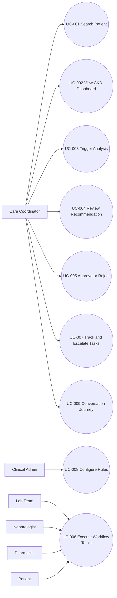

# AI Care Orchestration Platform Spec

## Document Control

| Field | Value |
|---|---|
| Artifact | Functional Specification |
| Version | 1.0 |
| Date | 2026-07-29 |
| Source | docs/eGFR_Business_Requirements_V1.md |
| Scope | eGFR care-gap detection and workflow orchestration prototype |

## 1. Executive Summary

This specification defines business-aligned, testable requirements for a CKD prototype that detects eGFR-related care gaps, routes decisions through a mandatory human approval gate, and orchestrates follow-up tasks to completion.

The system objective is operational reliability, not autonomous medicine. Every recommendation must be explainable, guideline-grounded, and blocked from execution until approved by a human coordinator.

## 2. Stakeholder Analysis

| Stakeholder | Primary Need | Success Signal |
|---|---|---|
| Care Coordinator | Rapid patient review, clear recommendations, low-friction approval | Can complete full workflow in minutes with clear rationale |
| Nephrologist | Timely, triaged referral tasks with context | Receives complete referral packages with care-gap basis |
| Lab Team | Accurate repeat test and UACR orders | Actionable task payloads and on-time completion |
| Pharmacist | Medication review triggers where relevant | Correctly assigned review tasks |
| Clinical Admin | Editable care logic without engineering support | Rule changes applied on next analysis |
| Patient | Timely notification and coordinated follow-up | Receives updates for approved workflow actions |
| AI/RAG/FHIR Teams | Stable contracts for interoperable services | Shared payloads processed without schema drift |
| Hackathon Judges | Demonstrable, safe orchestration capability | Full scenario execution with safety controls visible |

## 3. Business Objectives Mapping

| Business Objective | Requirement Coverage |
|---|---|
| BO-1 Detect care gaps early and consistently | FR-003, FR-004, FR-005, FR-006 |
| BO-2 Keep human control of clinical decisions | FR-009, FR-010, FR-011 |
| BO-3 Convert gaps into tracked tasks | FR-012, FR-013, FR-014, FR-015 |
| BO-4 Guideline-grounded recommendations | FR-005, FR-006, FR-007 |
| BO-5 Non-technical configurability | FR-016, FR-017 |
| BO-6 Screen and conversation parity | FR-018, FR-019 |

## 4. Functional Requirements (FR)

| ID | Requirement | Priority | Source BR |
|---|---|---|---|
| FR-001 | The system shall allow a coordinator to search and select a patient by core identifiers (name, patient ID, DOB). | Must | BR-01 |
| FR-002 | The system shall display a pre-analysis CKD summary view with raw patient data (demographics, CKD stage, latest and previous eGFR, UACR status, medication, last nephrology visit). | Must | BR-01, BR-02 |
| FR-003 | The system shall execute patient analysis only when explicitly triggered by the coordinator. | Must | BR-03 |
| FR-004 | The system shall assemble the patient clinical picture from available data inputs before AI analysis. | Must | BR-04 |
| FR-005 | The system shall identify CKD care gaps including at least declining eGFR, missing UACR, and overdue nephrology follow-up. | Must | BR-04 |
| FR-006 | The system shall present plain-language reasoning for each recommendation. | Must | BR-05 |
| FR-007 | The system shall attach guideline basis references for each recommendation. | Must | BR-06 |
| FR-008 | The system shall validate AI recommendations against configurable hospital business rules and flag unrecognized items for manual review. | Must | BR-07, BR-08 |
| FR-009 | The system shall require explicit human approval before any task creation. | Must | BR-10 |
| FR-010 | The system shall block all downstream actions until approval is recorded. | Must | BR-11 |
| FR-011 | The system shall record rejection decisions and terminate workflow execution cleanly with no task creation. | Must | BR-12 |
| FR-012 | The system shall convert each approved care gap into one or more concrete tasks with owner assignment. | Must | BR-13 |
| FR-013 | The system shall track each task state from Created to Completed (including timestamps and actor). | Must | BR-14 |
| FR-014 | The system shall notify task owners and patient when tasks are created after approval. | Must | BR-15 |
| FR-015 | The system shall escalate overdue tasks based on configured SLA windows. | Should | BR-16 |
| FR-016 | The system shall provide rule and workflow configuration controls for authorized non-technical administrators. | Should | BR-17 |
| FR-017 | The system shall apply configuration updates to subsequent analyses without redeployment. | Must | BR-18 |
| FR-018 | The system shall support end-to-end journey execution through the screen channel. | Must | BR-19 |
| FR-019 | The system shall support end-to-end journey execution through the conversation channel and return functionally equivalent outcomes. | Must | BR-19, BR-20 |
| FR-020 | The system shall maintain append-only, tamper-evident audit records for analysis, decision, and task actions. | Must | BR-21, BR-22, BR-23 |
| FR-021 | The system shall operate exclusively on synthetic patient data in prototype mode. | Must | BR-24 |
| FR-022 | The system shall provide mock-service fallback mode for AI, guideline, and data services to preserve demo continuity. | Must | BR-25 |
| FR-023 | The system shall display prototype and non-clinical-use disclosures at key decision points. | Must | BR-26 |

## 5. Non-Functional Requirements (NFR)

| ID | Requirement | Target |
|---|---|---|
| NFR-001 | Analysis response time | <= 5 seconds in mock mode for single patient workflow |
| NFR-002 | Task creation latency after approval | <= 2 seconds |
| NFR-003 | Availability for demo session | 99% during active demonstration window |
| NFR-004 | Reliability | Zero task creation events without explicit approval |
| NFR-005 | Auditability | 100% of analysis, decision, and task transitions logged |
| NFR-006 | Security baseline | Role-based access, input validation, secure transport for API calls |
| NFR-007 | Usability | Coordinator can complete the full journey in <= 10 minutes without training |
| NFR-008 | Accessibility | Channel UI follows WCAG 2.2 AA for keyboard navigation and contrast |
| NFR-009 | Resilience | Mock fallback activation in <= 30 seconds via configuration flag |

## 6. Technical Requirements (TR)

| ID | Requirement |
|---|---|
| TR-001 | FastAPI backend shall expose APIs for patient retrieval, analysis trigger, approval, task orchestration, notifications, and audit history. |
| TR-002 | Workflow orchestration shall model discrete states: Idle, Analysed, PendingApproval, Approved, Rejected, TasksCreated, InProgress, Completed. |
| TR-003 | Dialogflow CX webhook integration shall call the same backend endpoints as the screen channel. |
| TR-004 | Rule validation engine shall execute configurable mappings from care-gap type to task templates and SLAs. |
| TR-005 | Mock providers shall implement the same request/response contracts as live services. |
| TR-006 | Audit service shall write append-only records with immutable event IDs and hash-chain integrity metadata. |
| TR-007 | Notification service shall support owner-specific and patient-specific message templates. |
| TR-008 | Configuration changes shall be reloaded dynamically without service redeployment. |
| TR-009 | All externally provided text inputs shall be normalized and validated before processing. |

## 7. Data Requirements (DR)

| ID | Requirement |
|---|---|
| DR-001 | Patient record model shall include demographics, CKD stage, latest and prior eGFR values with timestamps, UACR status/date, medication summary, and last nephrology visit date. |
| DR-002 | AI analysis payload shall include risk level, care-gap list, confidence, rationale text, and guideline references. |
| DR-003 | Care-gap catalog shall define canonical gap codes (for example: EGFR_DECLINE, UACR_MISSING, NEPHROLOGY_OVERDUE). |
| DR-004 | Task model shall include task ID, gap code, owner role, due date, status, notification status, and completion evidence. |
| DR-005 | Audit model shall include event type, actor, timestamp, correlation ID, payload hash, and previous hash pointer. |
| DR-006 | Configuration model shall include rule versioning, effective date, and change actor metadata. |
| DR-007 | Prototype dataset shall contain synthetic identities only and no field copied from real patient systems. |

## 8. UX Requirements (UXR)

| ID | Requirement |
|---|---|
| UXR-001 | Dashboard shall present pre-analysis and post-analysis states distinctly to avoid misreading inferred content as raw data. |
| UXR-002 | Recommendation panel shall highlight risk level, guideline basis, and confidence with scannable hierarchy. |
| UXR-003 | Approval gate interaction shall require explicit confirm action and present the consequence of approve vs reject. |
| UXR-004 | Task timeline shall show owner, due date, and status progression with escalation indicators. |
| UXR-005 | Conversation prompts shall mirror screen terminology to preserve cognitive parity across channels. |
| UXR-006 | Prototype disclaimer shall be visible in dashboard, analysis output, and approval surfaces. |

## 9. Use Case Analysis

### 9.1 Use Case Diagram

### 9.2 Use Case Specifications

#### UC-001 Search and Select Patient
- Primary actor: Care Coordinator
- Trigger: Coordinator initiates patient lookup
- Preconditions: Authenticated user with coordinator role
- Main flow:
  1. User enters patient identifier criteria.
  2. System returns matching synthetic patient records.
  3. User selects target patient.
- Alternate flows:
  1. No result: system offers refined search.
- Postconditions: Patient context is active for dashboard view.
- Requirement mapping: FR-001, DR-001

#### UC-002 Review Pre-Analysis CKD Dashboard
- Primary actor: Care Coordinator
- Trigger: Patient selected
- Preconditions: Patient context active
- Main flow:
  1. System presents raw CKD data summary.
  2. User reviews baseline status before analysis.
- Postconditions: User can trigger analysis.
- Requirement mapping: FR-002, UXR-001

#### UC-003 Trigger Guideline-Grounded Analysis
- Primary actor: Care Coordinator
- Trigger: Analyze Patient action
- Preconditions: Dashboard loaded
- Main flow:
  1. User requests analysis.
  2. System assembles data and retrieves guideline context.
  3. AI service returns risk, care gaps, rationale, confidence.
  4. Rule engine validates and flags exceptions.
- Alternate flows:
  1. Service unavailable: system switches to mock providers.
- Postconditions: Recommendation package is available for review.
- Requirement mapping: FR-003 to FR-008, FR-022, TR-001, TR-005

#### UC-004 Review Recommendation
- Primary actor: Care Coordinator
- Trigger: Analysis completion
- Preconditions: Recommendation package generated
- Main flow:
  1. System displays risk level and care-gap summary.
  2. System shows plain-language reasoning and guideline basis.
  3. User evaluates confidence and flagged exceptions.
- Postconditions: User can approve or reject.
- Requirement mapping: FR-006, FR-007, FR-008, UXR-002

#### UC-005 Approve or Reject Recommendation
- Primary actor: Care Coordinator
- Trigger: Decision action
- Preconditions: Recommendation in PendingApproval
- Main flow:
  1. User explicitly approves or rejects.
  2. On approval, system unlocks workflow execution.
  3. On rejection, system records decision and stops execution.
- Postconditions:
  1. Approved: ready for task creation.
  2. Rejected: no task created.
- Requirement mapping: FR-009, FR-010, FR-011, NFR-004

#### UC-006 Create and Assign Workflow Tasks
- Primary actor: System
- Supporting actors: Lab Team, Nephrologist, Pharmacist, Patient
- Trigger: Approval received
- Preconditions: Decision is Approved
- Main flow:
  1. System maps care gaps to task templates.
  2. System creates tasks with owner and due date.
  3. System sends notifications to owners and patient.
- Postconditions: Tasks become trackable workflow items.
- Requirement mapping: FR-012, FR-014, TR-004, TR-007, DR-004

#### UC-007 Track, Escalate, and Close Workflow
- Primary actor: Care Coordinator
- Trigger: Tasks exist for patient workflow
- Preconditions: Task set created
- Main flow:
  1. System displays status progression.
  2. Owners update task completion.
  3. System escalates overdue tasks.
  4. Coordinator confirms closure.
- Postconditions: Workflow reaches Completed or escalated exception state.
- Requirement mapping: FR-013, FR-015, UXR-004

#### UC-008 Configure Rules and Workflow Mapping
- Primary actor: Clinical Admin
- Trigger: Policy update need
- Preconditions: Admin access granted
- Main flow:
  1. Admin edits rule parameters and mappings.
  2. System validates and versions changes.
  3. Changes become effective for next analysis.
- Postconditions: New analyses use updated rule set.
- Requirement mapping: FR-016, FR-017, TR-008, DR-006

#### UC-009 Execute Conversation Journey
- Primary actor: Care Coordinator
- Trigger: User starts Dialogflow CX session
- Preconditions: Dialogflow channel available
- Main flow:
  1. User searches patient via conversation.
  2. User requests analysis and reviews output.
  3. User approves or rejects recommendation.
  4. System creates and tracks tasks equivalent to screen flow.
- Postconditions: Parity with screen outcomes is preserved.
- Requirement mapping: FR-018, FR-019, TR-003, UXR-005

## 10. Epic Decomposition

| Epic ID | Epic Name | Mapped Requirements | Priority | Design Reference | Notes |
|---|---|---|---|---|---|
| EP-TECH | Platform Scaffolding and Shared Contracts | TR-001 to TR-009, DR-001 to DR-007 | Must | N/A | Greenfield bootstrap for FastAPI, FlutterFlow integration contracts, Dialogflow webhook stubs, mock providers |
| EP-001 | Patient Insight and Analysis Intake | FR-001 to FR-004, UXR-001 | Must | .propel/context/docs/designsystem.md#ep-001---patient-insight-and-analysis-intake | Patient search, baseline dashboard, analysis trigger |
| EP-002 | Explainable Care-Gap Intelligence | FR-005 to FR-008, UXR-002 | Must | .propel/context/docs/designsystem.md#ep-002---explainable-care-gap-intelligence | Gap detection, reasoning, guideline grounding, rule validation |
| EP-003 | Human Approval Control Gate | FR-009 to FR-011, UXR-003, NFR-004 | Must | .propel/context/docs/designsystem.md#ep-003---human-approval-control-gate | Mandatory decision gate with reject-safe termination |
| EP-004 | Workflow Orchestration and Notifications | FR-012 to FR-015, UXR-004 | Must | .propel/context/docs/designsystem.md#ep-004---workflow-orchestration-and-notifications | Task generation, assignment, notification, escalation |
| EP-005 | Admin Configurability and Runtime Adaptation | FR-016, FR-017, DR-006 | Must | .propel/context/docs/designsystem.md#ep-005---admin-configurability-and-runtime-adaptation | Editable rules/workflows with live application |
| EP-006 | Omnichannel Experience Parity | FR-018, FR-019, UXR-005 | Must | .propel/context/docs/designsystem.md#ep-006---omnichannel-experience-parity | Screen and conversation behavioral parity |
| EP-007 | Auditability, Safety, and Resilience | FR-020 to FR-023, NFR-005, NFR-009, UXR-006 | Must | .propel/context/docs/designsystem.md#ep-007---auditability-safety-and-resilience | Tamper-evident audit, synthetic-only data, mock fallback, prototype disclosure |

## 11. Technical Architecture Considerations

### Primary Choice
- Frontend and conversational channels: FlutterFlow screens and Dialogflow CX agent.
- Orchestration backend: FastAPI service exposing workflow and audit APIs.
- Integration model: Shared backend contracts across channels for deterministic parity.
- Data mode: Synthetic dataset plus mock adapters for AI, guideline retrieval, and data services.

### Secondary Choice
- If live service integration is unstable, use fully mocked adapters behind feature flags.
- If conversation latency is high, route intent fulfillment through pre-composed backend response templates.
- If append-only hash-chain is heavy for demo, persist immutable event log with periodic digest snapshots.

## 12. Success Metrics and Validation Criteria

| Metric | Validation Rule | Target |
|---|---|---|
| Care gaps detected for John Smith scenario | Verify all three expected gaps returned | 3 of 3 |
| Recommendations with guideline basis | Verify each recommendation has source reference | 100% |
| Actions without approval | Query audit/task events for pre-approval creations | 0 |
| Approved gaps converted to tasks | Compare approved gaps vs created tasks | 100% |
| Rule update without redeploy | Change rule and rerun analysis | Demonstrated |
| Screen-conversation parity | Compare outputs for same patient and decision path | Equivalent outcome |
| Analysis-to-task lead time | Measure approval timestamp to task creation timestamp | <= 2 seconds |
| Offline demo continuity | Disable live services and rerun full journey | Pass |

## 13. Requirement Traceability Matrix

| Source BR | Derived Requirements |
|---|---|
| BR-01 to BR-03 | FR-001 to FR-003 |
| BR-04 to BR-09 | FR-004 to FR-008 |
| BR-10 to BR-12 | FR-009 to FR-011 |
| BR-13 to BR-16 | FR-012 to FR-015 |
| BR-17 to BR-18 | FR-016 to FR-017 |
| BR-19 to BR-20 | FR-018 to FR-019 |
| BR-21 to BR-23 | FR-020 |
| BR-24 to BR-26 | FR-021 to FR-023 |

## 14. Open Assumptions and Constraints

1. AI and RAG teams will maintain stable response contracts during prototype timeline.
2. Canonical care-gap codes will be frozen before implementation starts.
3. Notification channels are demo-grade and do not require enterprise messaging infrastructure.
4. No real patient data ingestion is permitted in any environment.

## 15. Out-of-Scope Confirmation

The following remain out of scope for this specification baseline: model training, live EHR integration, production SSO, multi-hospital tenancy implementation, regulatory certification, and native mobile applications.
