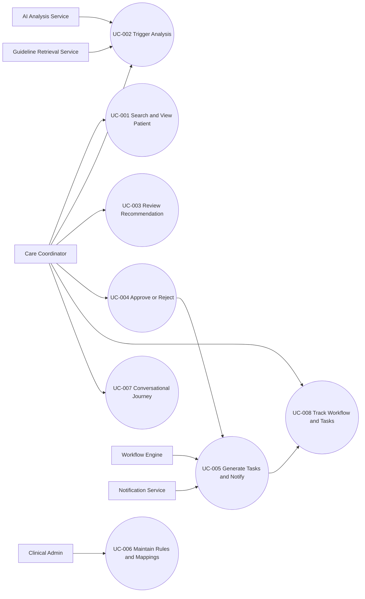

# Requirements Specification

## Executive Summary

This specification defines the product requirements for a hackathon prototype that detects CKD care gaps from eGFR-centered patient data and orchestrates follow-through workflows after explicit human approval. The platform supports two equivalent coordinator channels: screen-based workflow application and Dialogflow CX conversational experience. The design is trust-first and approval-gated: AI recommends, humans decide.

This prototype is not a medical device and must not be used for clinical decision-making. All patient data is synthetic.

## Feature Goal

Build a low-code care orchestration capability that:

- Detects CKD care gaps consistently from patient data and guideline context.
- Explains recommendations in plain language with visible guideline grounding.
- Enforces a mandatory human approval gate before any workflow task creation.
- Converts approved care gaps into owned, tracked, and notified tasks.
- Preserves full accountability with append-only, tamper-evident event history.
- Delivers channel parity between FlutterFlow UI and Dialogflow CX conversation.

## Business Justification

- Manual review is inconsistent and error-prone under time pressure.
- Missed CKD monitoring actions increase avoidable progression risk.
- Recommendation value is only realized when converted into executed follow-up.
- Human-in-the-loop governance is mandatory for trust, safety, and adoption.
- Hospitals require local configurability without engineering release cycles.

## Scope

### In Scope

- Patient search and patient dashboard view.
- On-demand patient analysis trigger.
- AI recommendation ingestion and business-rule validation.
- Human approval/rejection gate.
- Workflow and task generation per approved care gap.
- Task ownership, notifications, escalation, and completion tracking.
- Conversational coordinator journey via Dialogflow CX with backend parity.
- Analytics and audit timeline views.
- Mock/offline mode for demo resiliency.

### Out of Scope

- Model training/tuning and clinical model accuracy validation.
- Guideline KB construction and embeddings authoring.
- Production live EHR/lab/pharmacy integrations.
- Regulatory certification and clinical deployment.
- Real patient data use.

## Stakeholders

| Stakeholder | Primary Concern | Product Role |
|---|---|---|
| Care Coordinator | Fast, safe decision support and follow-through | Primary operator and approver |
| Nephrologist/Doctor | Quality referrals with context | Downstream task owner |
| Lab Team | Clear and actionable lab tasks | Downstream task owner |
| Pharmacist | Medication review when triggered | Downstream task owner |
| Hospital Clinical Admin | Configurable local rules and workflows | Rule/workflow configurator |
| Patient | Timely monitoring follow-up communication | Notification recipient |
| AI/RAG/FHIR Teams | Stable contracts and service dependencies | Upstream providers |
| Hackathon Judges | End-to-end orchestration proof and safety posture | External evaluators |

## Current-to-Future State

- Current: manual cross-referencing, inconsistent gap detection, weak follow-through, limited auditability.
- Future: on-demand guideline-grounded analysis, deterministic approval gate, orchestrated task tracking, full traceability.

## Functional Requirements

### AI Suitability Triage

| Classification | Count | Description |
|---|---:|---|
| [DETERMINISTIC] | 16 | Deterministic retrieval, validation, gating, workflow orchestration |
| [AI-CANDIDATE] | 4 | Risk and gap recommendation generation from clinical context |
| [HYBRID] | 6 | AI suggestion plus human approval and rule overlays |

### Module 1: Patient Insight and Analysis Trigger

- FR-001: [DETERMINISTIC] System MUST allow a care coordinator to find a patient and open a unified CKD profile.
- FR-002: [DETERMINISTIC] System MUST display raw patient CKD data before analysis is requested.
- FR-003: [DETERMINISTIC] System MUST support explicit on-demand analysis initiation per patient.

### Module 2: Recommendation Generation and Validation

- FR-004: [AI-CANDIDATE] System MUST identify likely CKD care gaps from patient data and guideline context.
- FR-005: [HYBRID] System MUST present plain-language reasoning for each recommendation.
- FR-006: [HYBRID] System MUST attach visible guideline grounding for each recommendation.
- FR-007: [DETERMINISTIC] System MUST validate AI recommendations against configurable hospital rules before actionability.
- FR-008: [DETERMINISTIC] System MUST flag rule-unrecognized recommendations for manual handling and MUST NOT auto-act.
- FR-009: [HYBRID] System SHOULD route low-confidence analyses to explicit human review state.

### Module 3: Human Control Gate

- FR-010: [DETERMINISTIC] System MUST require explicit human approval before any downstream task creation.
- FR-011: [DETERMINISTIC] System MUST create no tasks and trigger no downstream actions before approval.
- FR-012: [DETERMINISTIC] System MUST stop processing on rejection and record rejection rationale and actor.

### Module 4: Workflow Orchestration and Follow-Through

- FR-013: [DETERMINISTIC] System MUST convert each approved care gap into concrete tasks with correct owner mapping.
- FR-014: [DETERMINISTIC] System MUST track task lifecycle states from creation to completion.
- FR-015: [DETERMINISTIC] System MUST notify all task owners and the patient on task creation.
- FR-016: [DETERMINISTIC] System SHOULD escalate overdue or unacted tasks according to configured thresholds.

### Module 5: Configurability

- FR-017: [DETERMINISTIC] System SHOULD allow non-technical admins to edit care-gap rules and workflow mappings.
- FR-018: [DETERMINISTIC] System MUST apply approved configuration changes to the next analysis without redeployment.

### Module 6: Channel Parity (UI and Conversation)

- FR-019: [HYBRID] System MUST allow coordinators to execute the full journey via conversation (Dialogflow CX) in addition to UI.
- FR-020: [DETERMINISTIC] System MUST produce equivalent outcomes across UI and conversation channels for the same inputs.

### Module 7: Accountability, Safety, and Demo Resilience

- FR-021: [DETERMINISTIC] System MUST record every analysis, approval, rejection, task action, and notification event.
- FR-022: [DETERMINISTIC] System MUST reconstruct complete patient-level history from analysis through closure.
- FR-023: [DETERMINISTIC] System MUST store records as append-only and tamper-evident.
- FR-024: [DETERMINISTIC] System MUST use synthetic patient data only.
- FR-025: [DETERMINISTIC] System MUST support a fully demonstrable mock mode when external dependencies are unavailable.
- FR-026: [DETERMINISTIC] System MUST clearly label the experience as prototype-only and not clinical decision support.

## Non-Functional Requirements

- NFR-001: System MUST keep median coordinator interactions responsive, with p95 API response <= 2 seconds for non-AI endpoints under demo load.
- NFR-002: System MUST complete analysis-to-task-creation flow in seconds for the demo happy path after approval.
- NFR-003: System MUST maintain channel parity reliability such that UI and conversation produce equivalent workflow artifacts for identical inputs.
- NFR-004: System MUST provide availability fallback via mock mode for all required demo steps.
- NFR-005: System MUST enforce role-based access for coordinator and admin operations.
- NFR-006: System MUST encrypt data in transit with TLS 1.2+.
- NFR-007: System MUST prevent use of real PHI and enforce synthetic-only dataset policy in the prototype.
- NFR-008: System MUST retain immutable audit records for all state-changing actions.
- NFR-009: System MUST log correlation IDs across channel requests for traceability.
- NFR-010: System MUST degrade gracefully if AI/RAG/FHIR endpoints are unreachable, using mocks and clear status signaling.

## Technical Requirements

- TR-001: Backend orchestration services MUST be exposed through FastAPI endpoints for UI and Dialogflow webhook consumption.
- TR-002: Dialogflow CX fulfillment MUST call the same orchestration APIs used by the UI path.
- TR-003: Recommendation payload contract MUST include risk level, care gaps, reasoning, guideline references, confidence, and recommended actions.
- TR-004: Rule engine MUST evaluate recommendation payloads against editable configuration without code redeploy.
- TR-005: Workflow engine MUST map validated gap types to owner-specific task templates.
- TR-006: Notification service MUST support owner and patient notifications with retry and failure logging.
- TR-007: Audit event model MUST capture actor, action, timestamp, payload hash, and source channel.
- TR-008: Mock service switch MUST support offline demo mode with deterministic fixture responses.
- TR-009: Analytics endpoints MUST expose task status aggregates and approval-gate metrics.
- TR-010: Shared canonical vocabulary for care-gap types MUST be versioned and frozen per release.

## Data Requirements

- DR-001: Patient profile MUST include demographics, CKD stage, eGFR current/prior values, UACR status, medication summary, and last nephrology visit date.
- DR-002: Analysis result MUST include risk classification, detected gaps, guideline evidence pointers, confidence, and generated-at timestamp.
- DR-003: Decision record MUST include approver identity, decision outcome, rationale, and timestamp.
- DR-004: Task record MUST include owner role, due date, status transitions, and linkage to originating gap.
- DR-005: Audit record MUST be append-only and include previous-event linkage or cryptographic hash chain metadata.
- DR-006: Rule configuration entities MUST be human-editable and versioned with effective-from timestamp.
- DR-007: All patient-like records in prototype datasets MUST be synthetic and traceable to seed fixtures.

## UX Requirements

- UXR-001: Coordinator MUST see raw CKD data before any AI output.
- UXR-002: Recommendation view MUST show risk, gap list, plain-language reasoning, and guideline basis in one view.
- UXR-003: Approval/rejection controls MUST be explicit and unambiguous.
- UXR-004: Task creation confirmation MUST be visible only after approval.
- UXR-005: Conversation prompts MUST mirror UI decision points and confirmations.
- UXR-006: Channel outputs MUST use consistent terminology for care gaps and actions.
- UXR-007: Prototype safety disclaimer MUST be visible in both channels.

## Use Case Analysis

### Actors

| Actor | Type | Responsibility |
|---|---|---|
| Care Coordinator | Primary | Initiates analysis, reviews recommendations, approves/rejects |
| Hospital Clinical Admin | Primary | Maintains rules and workflow mappings |
| Lab Team | Secondary | Executes lab-related tasks |
| Nephrologist/Doctor | Secondary | Executes specialist follow-up tasks |
| Pharmacist | Secondary | Executes medication review tasks |
| Patient | Secondary | Receives workflow-related notifications |
| AI Analysis Service | System | Produces risk/gap recommendations |
| Guideline Retrieval Service | System | Returns applicable guideline context |
| Workflow Engine | System | Creates and tracks tasks |
| Notification Service | System | Sends owner and patient notifications |

### System Use Case Diagram

### UC-001: Search and View Patient CKD Profile

- Primary Actor: Care Coordinator
- Goal: Find patient and review raw CKD context before analysis.
- Preconditions: Coordinator is authenticated and authorized.
- Main Flow:
  1. Coordinator searches by patient identifier.
  2. System returns matching patient records.
  3. Coordinator selects patient.
  4. System displays CKD profile with raw data.
- Alternate Flows:
  - 2a. No patient found: system shows no-results and allows retry.
- Postconditions: Selected patient context is active for next actions.
- Traceability: FR-001, FR-002, UXR-001

### UC-002: Trigger and Execute Patient Analysis

- Primary Actor: Care Coordinator
- Goal: Run on-demand analysis for selected patient.
- Preconditions: UC-001 completed; patient context loaded.
- Main Flow:
  1. Coordinator clicks Analyze Patient (or equivalent conversational intent).
  2. System assembles patient clinical context.
  3. System retrieves relevant CKD guideline context.
  4. AI service returns risk, gaps, and recommendations.
  5. Rule engine validates recommendation set.
- Alternate Flows:
  - 4a. AI unavailable: system uses mock response in demo mode.
  - 5a. Unknown gap type: system flags for manual handling.
- Postconditions: Validated recommendation package available for review.
- Traceability: FR-003, FR-004, FR-007, FR-008, FR-025

### UC-003: Review Recommendation Package

- Primary Actor: Care Coordinator
- Goal: Evaluate recommendation quality and actionability.
- Preconditions: UC-002 completed.
- Main Flow:
  1. System presents risk, gaps, reasoning, guideline references, and confidence.
  2. Coordinator reviews content and determines decision readiness.
- Alternate Flows:
  - 1a. Low confidence result: routed to explicit human review state.
- Postconditions: Coordinator prepared to approve or reject.
- Traceability: FR-005, FR-006, FR-009, UXR-002

### UC-004: Approve or Reject Recommendation

- Primary Actor: Care Coordinator
- Goal: Enforce human decision gate.
- Preconditions: UC-003 completed.
- Main Flow:
  1. Coordinator chooses Approve or Reject.
  2. System records decision, actor, and timestamp.
  3. If approved, system authorizes downstream task generation.
  4. If rejected, system terminates orchestration.
- Alternate Flows:
  - 1a. Missing decision rationale policy requires rationale before submission.
- Postconditions: Approved path proceeds; rejected path closed.
- Traceability: FR-010, FR-011, FR-012, FR-021

### UC-005: Generate Tasks and Notify Stakeholders

- Primary Actor: Workflow Engine (system), initiated by Care Coordinator approval
- Goal: Convert approved gaps to owned follow-through.
- Preconditions: UC-004 approved.
- Main Flow:
  1. System maps each approved gap to workflow template.
  2. System creates tasks with owner assignment and due windows.
  3. System sends notifications to owners and patient.
  4. System starts tracking task lifecycle.
- Alternate Flows:
  - 3a. Notification failure: system retries and logs failures.
- Postconditions: Tasks are active and visible in tracking views.
- Traceability: FR-013, FR-014, FR-015, FR-016

### UC-006: Maintain Rules and Workflow Mappings

- Primary Actor: Hospital Clinical Admin
- Goal: Update local policy logic without redeploy.
- Preconditions: Admin authenticated and authorized.
- Main Flow:
  1. Admin edits rule threshold or workflow mapping.
  2. System validates configuration syntax and semantics.
  3. Admin publishes configuration version.
  4. System applies new configuration to next analysis.
- Alternate Flows:
  - 2a. Invalid rule definition: system blocks publication and provides errors.
- Postconditions: New active rule version recorded.
- Traceability: FR-017, FR-018, DR-006

### UC-007: Execute Full Journey via Conversation

- Primary Actor: Care Coordinator
- Goal: Complete end-to-end flow through Dialogflow CX.
- Preconditions: Coordinator authenticated; channel available.
- Main Flow:
  1. Coordinator asks assistant to locate patient.
  2. Assistant presents raw data summary.
  3. Coordinator requests analysis.
  4. Assistant presents recommendation package.
  5. Coordinator approves/rejects.
  6. Assistant confirms resulting workflow status.
- Alternate Flows:
  - 4a. Ambiguous intent: assistant requests clarification.
- Postconditions: Outcome matches equivalent UI path.
- Traceability: FR-019, FR-020, UXR-005, UXR-006

### UC-008: Track Workflow to Completion and Audit History

- Primary Actor: Care Coordinator
- Goal: Monitor work completion and reconstruct full history.
- Preconditions: At least one approved workflow exists.
- Main Flow:
  1. Coordinator opens workflow tracking view.
  2. System shows task statuses, owners, and overdue flags.
  3. Coordinator opens patient audit timeline.
  4. System reconstructs full chain: analysis -> decision -> tasks -> actions.
- Alternate Flows:
  - 2a. Overdue task detected: escalation notification is triggered.
- Postconditions: Coordinator has complete operational and audit visibility.
- Traceability: FR-014, FR-016, FR-021, FR-022, FR-023

## Epic Decomposition

| Epic ID | Epic Name | Mapped Requirements | Mapped Use Cases |
|---|---|---|---|
| EP-001 | Patient Context and Analysis Intake | FR-001 to FR-004, DR-001 to DR-003 | UC-001, UC-002 |
| EP-002 | Trustworthy Recommendations and Validation | FR-005 to FR-009, TR-003, TR-004 | UC-002, UC-003 |
| EP-003 | Human Approval Gate | FR-010 to FR-012, NFR-008 | UC-004 |
| EP-004 | Workflow Orchestration and Notifications | FR-013 to FR-016, TR-005, TR-006, DR-004 | UC-005, UC-008 |
| EP-005 | Configurable Care Logic | FR-017, FR-018, TR-004, DR-006 | UC-006 |
| EP-006 | Multi-Channel Parity (UI + CX) | FR-019, FR-020, NFR-003, TR-002 | UC-007 |
| EP-007 | Accountability, Safety, and Resilience | FR-021 to FR-026, NFR-004 to NFR-010, TR-008, TR-009 | UC-008 |

## Technical Architecture Considerations

### Primary Choice (Hackathon-Optimized)

- UI: FlutterFlow for coordinator dashboard and tracking views.
- Conversation: Dialogflow CX with webhook fulfillment.
- Orchestration API: FastAPI as shared business backend.
- Rule/Workflow Config Store: editable JSON/YAML config with versioning.
- Event/Audit Store: append-only event model in backend persistence.
- Mock Mode: feature flag to switch AI/RAG/FHIR dependencies to fixtures.

### Secondary Choice (Production Direction)

- Move rule/config storage to managed policy service with approval workflow.
- Introduce dedicated workflow queue/worker and retry orchestration.
- Add enterprise IAM and stronger key management boundaries.
- Add formal observability stack for SLO monitoring.

## Success Metrics and Validation

| Metric | Target | Validation Method |
|---|---|---|
| Care gaps detected for demo patient | All 3 expected gaps detected | Golden test dataset replay |
| Recommendations with guideline basis | 100% | Recommendation payload checks |
| Actions without approval | 0 | Audit event assertions |
| Approved gaps converted to tracked tasks | 100% | Workflow-task linkage checks |
| Rule update without redeploy | Demonstrated live | Config publish + next-run verification |
| Channel parity for core journey | Equivalent outcomes | Cross-channel snapshot comparison |
| Analysis-to-task latency post-approval | Seconds | Telemetry timestamps |
| Full offline demo viability | Pass | Mock-mode end-to-end rehearsal |

## Risks and Mitigations

| Risk | Impact | Mitigation |
|---|---|---|
| Approval gate bypass in implementation | Safety and trust failure | Hard block in orchestration path; explicit tests |
| Recommendation lacks visible grounding | Perceived black-box output | Enforce required evidence fields |
| Rules hardcoded | Configurability claim fails | Runtime versioned config store |
| UI/CX divergence | Inconsistent coordinator outcomes | Shared backend contracts and parity tests |
| Vocabulary drift across teams | Mapping failures | Frozen, versioned gap taxonomy |
| External outage during demo | Demo failure | Mock mode fallback for all dependencies |
| Real data leakage | Governance breach | Synthetic data policy and checks |

## Acceptance Criteria Summary

- Core journey from search -> analyze -> approve/reject -> task generation -> tracking is functional.
- No task exists before approval in any channel path.
- Recommendation payload always includes reasoning and guideline basis.
- Config changes apply to next analysis without redeploy.
- Audit history can reconstruct end-to-end decision and action chain.
- Mock mode demonstrates complete workflow when upstream services are unavailable.
